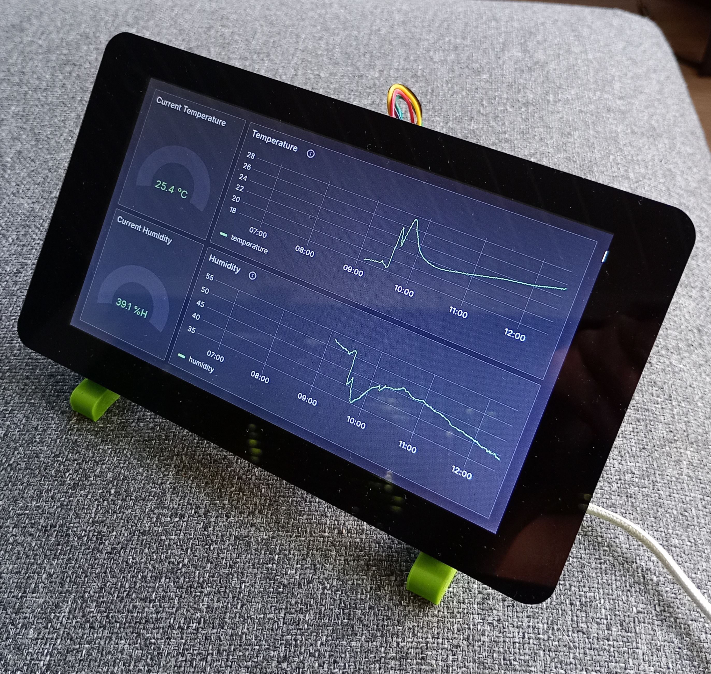

# Raspberry Pi IoT Dashboard


**Deze opstelling maakt van een Raspberry Pi een lokale datahub en monitor voor Internet of Things-projecten.** De Raspberry Pi draait `InfluxDB 3` (een efficiënte tijdreeksdatabase) en `Grafana` (een krachtige tool voor datavisualisatie), met een scherm voor directe visualisatie.

IoT-apparaten op het netwerk (Arduino, Raspberry Pi, ...) kunnen meetgegevens naar deze datahub sturen, waar deze worden opgeslagen en visueel worden weergegeven. Dit maakt het ideaal voor projecten rond sensoren, dataverwerking, netwerken en visualisatie. Hiermee kunnen leerlingen inzicht verwerven in hoe data wordt verzameld, verwerkt en gevisualiseerd binnen een IoT-context.

<br clear="right"/>

**Hardware:**
- **Raspberry Pi 3B+/4B/5B** single-board computer
- **Raspberry Pi 7" Touch Display** om de data weer te geven

**Software:**
- **Opslag van sensor data** met `InfluxDB` database
- **Visualisatie van de data** met `Grafana` dashboard
- **Lokale weergave** met `Chromium` webbrowser

## Getting Started
### Opstelling
De kern van het systeem is een **Raspberry Pi** met het **Raspberry Pi 7" Touch Display** (of klein HDMI-scherm). De Raspberry Pi is verbonden met het lokale netwerk via wifi of een netwerkkabel, zodat IoT-opstellingen zoals Arduino’s of andere Raspberry Pi’s via het netwerk gegevens kunnen doorsturen.

>[!TIP]
>**Het is aangeraden om een appart (wifi) netwerk te voorzien voor IoT projecten.** Bespreek dit met je ICT coordinator.

We gaan ervan uit dat een SD kaartje reeds geinstalleerd is met hierop `Raspberry Pi OS`, en toegang tot de opstelling via `SSH` of via een `terminal`-applicatie op de lokale grafische interface.

Voor we beginnen zorgen we dat ons systeem up-to-date is:
```sh
sudo apt update
sudo apt upgrade -y
```
### InfluxDB
`InfluxDB` is een gespecialiseerde database voor tijdsgebonden data - denk aan temperatuurmetingen, CO₂-waarden of lichtintensiteit die om de paar seconden worden doorgestuurd door IoT-sensoren.

In tegenstelling tot een klassieke relationele database (zoals MySQL), is InfluxDB ontworpen om efficiënt grote hoeveelheden meetdata te verwerken en op te slaan. Het systeem begrijpt meteen wat je bedoelt met “laat de laatste waarde zien” of “bereken het gemiddelde van de afgelopen 10 minuten”.

#### Installatie
Installeer `InfluxDB`, en volg de instructies van het installatiescript
```sh
curl -O https://www.influxdata.com/d/install_influxdb3.sh
sh install_influxdb3.sh
```
Om de `InfluxDB CLI` te kunnen gebruiken, moet je eerst het volgende commando uitvoeren. Test of je het kan gebruiken door de versie op te vragen.
```sh
source ~/.bashrc
influxdb3 --version
```

Database server starten:
```sh
influxdb3 serve --object-store file --data-dir ~/.influxdb3 --node-id node0
```

We willen dat InfluxDB ook start bij het opstarten. Voeg hiervoor volgende lijn toe in het bestand `/etc/xdg/labwc/autostart`:
```
/home/mechatronica/.influxdb//influxdb3 serve --object-store file --data-dir ~/.influxdb3 --node-id node0 &
```

#### Aanmaken database & gebruiker
Toegang `token` genereren voor de `admin` gebruiker:
```sh
influxdb3 create token --admin
```
>[!IMPORTANT]
> **Hou deze `token` goed bij!** Deze hebben we nodig om toegang the hebben tot de database.
> Token: apiv3_twVOSg3DPHEVzmaQ64sbDv6tlCdo9jFC8JG0UQgHHxfDaWNUYnauYpZXpLLm7QtOi2YSITPkL5dZy760HfeKAg

Onze `database` voor de sensor data aanmaken:
```sh
influxdb3 create database sensors --token apiv3_twVOSg3DPHEVzmaQ64sbDv6tlCdo9jFC8JG0UQgHHxfDaWNUYnauYpZXpLLm7QtOi2YSITPkL5dZy760HfeKAg
```

>[!TIP]
>Om vanuit een Python programma data weg te schrijven naar de `InfluxDB` database via HTTP, gebruik de je `influxdb3-python` library.

#### referenties:
https://docs.influxdata.com/influxdb3/core/reference/cli/influxdb3/

### Grafana
`Grafana` is een krachtige visualisatietool waarmee je live dashboards bouwt op basis van de data in InfluxDB. In plaats van saaie tabellen zie je dynamische grafieken, meters en diagrammen die onmiddellijk reageren op wat er in het systeem gebeurt. Het is dé tool die in professionele omgevingen gebruikt wordt om processen, machines of omgevingsdata te monitoren.

#### Installatie
Voeg de `Grafana` repository en key to aan de `apt` package manager (als administrator):
```sh
sudo curl -fsSL https://packages.grafana.com/gpg.key | gpg --dearmor | sudo tee /etc/apt/keyrings/grafana-archive-keyring.gpg > /dev/null
sudo echo "deb [signed-by=/etc/apt/keyrings/grafana-archive-keyring.gpg] https://packages.grafana.com/oss/deb stable main" | sudo tee /etc/apt/sources.list.d/grafana.list
```
Installeer `Grafana` met `apt` (als administrator):
```sh
sudo apt update
sudo apt install grafana
```
Start de `Grafana` systeem service met `systemctl`:
```sh
sudo systemctl enable grafana-server
sudo systemctl start grafana-server
```
Controleer de status van de `Grafana` service
```sh
sudo systemctl status grafana-server
```

#### Configure Grafana auto-login
in `/etc/grafana/grafana.ini`, wijzig deze lijn naar 'true':
```
[auth.anonymous]
enabled = true
org_name = Main Org.
org_role = Viewer

```
### Chromium (browser)
Om het Grafana-dashboard rechtstreeks op het aangesloten scherm van de Raspberry Pi weer te geven, gebruiken we de Chromium-browser. Dit is de open-source basis van Google Chrome, en draait vlot op de Raspberry Pi. Chromium wordt zo ingesteld dat het automatisch opstart in volledig scherm (kioskmodus) en het lokale Grafana-dashboard toont. Op die manier wordt het scherm een visualisatiepaneel.

Installeer de `Chromium` web browser:
```
sudo apt install chromium-browser
```
Om te zorgen dat de `Chromium` browser start op ons `Grafana` dashboard wanneer de Raspberry Pi opstart, voeg volgende lijn toe in het bestand `/etc/xdg/labwc/autostart`:
```
sleep 5 && /usr/bin/chromium-browser --kiosk --noerrdialogs --disable-infobars --ozone-platform=wayland http://localhost:3000/d/bel1pwxub2fwga/monitor?orgId=1&kiosk= &

```

>[!TIP]
>Om de `Chromium` browser te sluiten wanneer die in kiosk-modus is, sluit je een toetsenbord aan en druk je `alt+F4`


#### Configureer `InfluxDB` als databron voor `Grafana`
1) In de browser, open het Grafana dashboard `https://localhost:3000`, en log in met de `admin` credentials.
2) Connecteer met de Influx als databron
```
Query language: SQL

--- HTTP ---
URL: http://localhost:8181

--- InfluxDB details ---
Database: Sensors
Token: <token from earlier>
Insecure connection: true
```

## Licentie
**Copyright© 2025 Mechatronica Campus De Vesten**. Dit project is gedeeld onder de [**MIT-licentie**](LICENSE.txt).